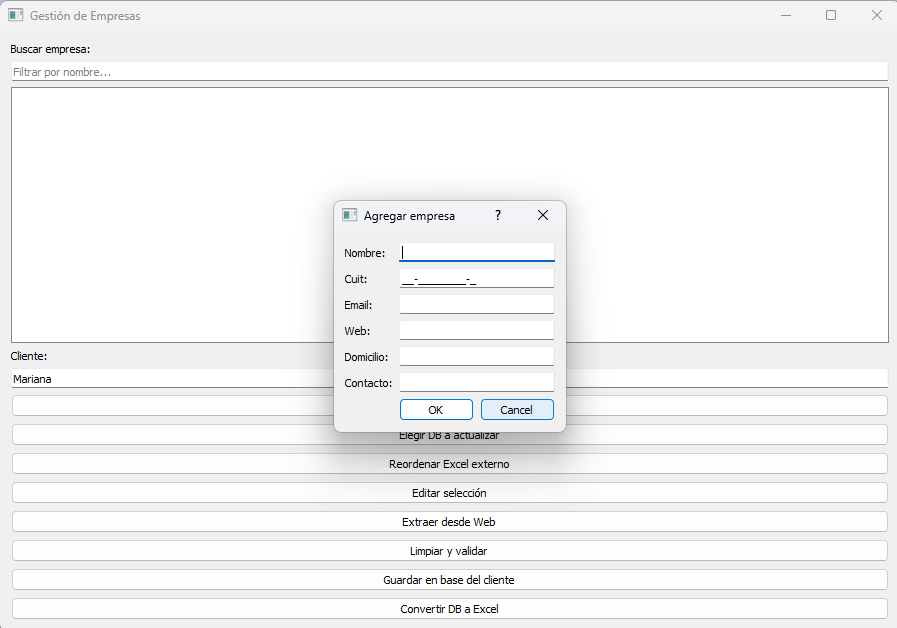
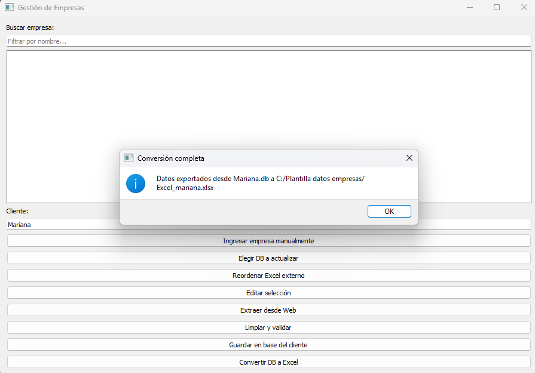
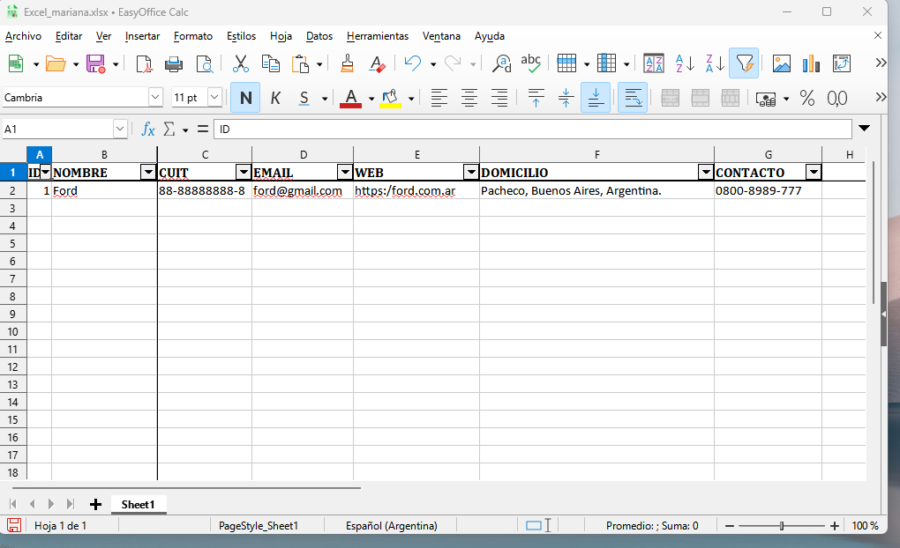

# Sistema Multiempresa

## 🌟 Presentación
Un sistema pensado para pequeñas y medianas empresas que necesitan **gestionar datos de múltiples compañías** de forma simple, ordenada y profesional.

## 🚀 Beneficios
- Exportación de datos a Excel con formato profesional (encabezados en negrita, filtros automáticos, columnas ajustadas).
- Interfaz amigable con **PyQt5** y opción de uso con **Flet** para ingreso de datos.
- Arquitectura modular que permite escalar y adaptarse a distintos rubros.
- Reportes claros y listos para compartir con clientes o auditores.

## 🖼️ Capturas de pantalla
Ejemplo de salida en Excel:

  
  
  
  
  
  

## ▶️ Demo
El sistema permite:
- Cargar y administrar múltiples bases de datos de empresas.
- Exportar información con un clic.
- Visualizar resultados en una interfaz clara y moderna.

📂 Gestión de bases de datos
El sistema permite trabajar con múltiples archivos .db (SQLite), cada uno representando una empresa distinta.
Desde la interfaz, se puede seleccionar qué base cargar, visualizar los datos y exportarlos a Excel con un solo clic.
Esto facilita la administración de clientes, sucursales o unidades de negocio de forma independiente y ordenada.

## 💼 Casos de uso
Ideal para:
- Estudios contables que gestionan múltiples clientes.
- PYMEs con sucursales o unidades de negocio independientes.
- Profesionales que necesitan generar reportes rápidos y ordenados.
- Freelancers que ofrecen soluciones de gestión a terceros.

## 📦 Entrega
El sistema se entrega como:
- Código fuente modular y documentado.
- Ejecutable `.exe` listo para usar en Windows (sin necesidad de instalar Python).
- Carpeta de distribución con instrucciones y estructura profesional.

## 🧩 Personalización
Se puede adaptar fácilmente a:
- Nuevos campos o estructuras de datos.
- Exportación a PDF, CSV u otros formatos.
- Integración con bases de datos externas o APIs.

## ⚙️ Compatibilidad
- Windows 10/11 con Python 3.10+  
- Adaptable a Linux y macOS

## 📜 Licencia
Distribuido bajo licencia MIT, lo que garantiza libertad de uso y adaptación.

## 📞 Contacto
¿Querés adaptar este sistema a tu negocio o integrarlo en tu flujo de trabajo?

**Consultas y propuestas**:  
📧 srghrnn.cc@gmail.com  
🌐 https://github.com/Bigote499
🌐 https://www.freelancer.com/u/sergios846
