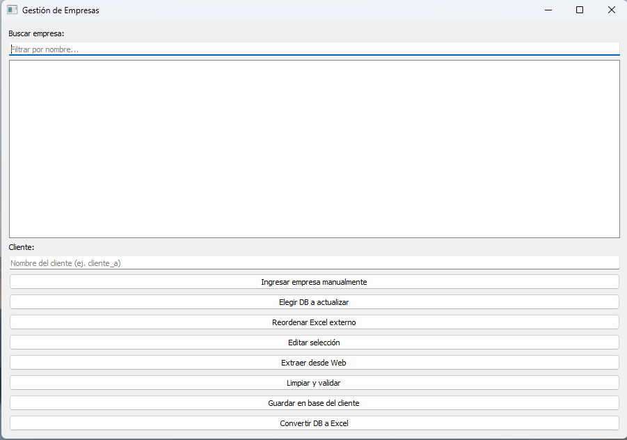
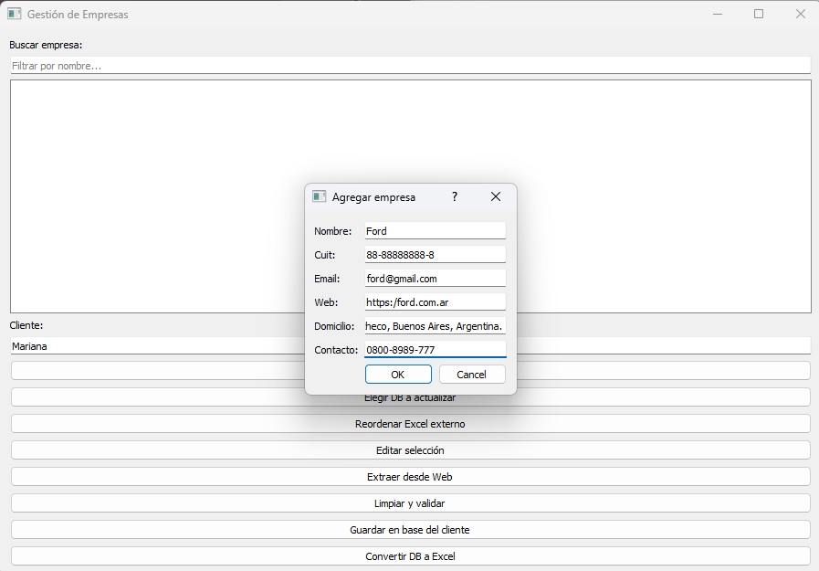

🌐 Read this in [Spanish](README_es.md)

#Multi-Company System

This project allows managing data from multiple companies, storing them in SQLAlchemy databases, and exporting them to Excel with professional formatting. Ideal for businesses, freelance developers, or administrative environments.

## 🚀 Main Features

• 	Create, edit, and delete companies through a graphical interface (PyQt5).
• 	Export to Excel with:
• 	Bold and uppercase headers
• 	Automatic filters
• 	Frozen header row and key columns (ID and NAME)
• 	Automatic column width adjustment
• 	Text alignment and wrapping
• 	CUIT validation and input field checks.
• 	Modular code separation (interface, logic, utilities, formatting).
• 	Compatible with multiple  databases.

## 🧱 Project Structure

multi-company-system/
├── main.py                  # Application entry point
├── interfaz_empresas.py     # Main window (PyQt5)
├── ventana_carga_empresas.py # Data entry form
├── db_manager.py            # SQLAlchemy connection and operations
├── guardar_datos.py         # Data persistence logic
├── format_excel.py          # Professional Excel formatting
├── excel_empresas.py        # Excel file generation
├── reporte_empresas.py      # Reports and summaries
├── extraer_web.py           # Data extraction from the web
├── utilidades.py            # Validations and helper functions
├── id_empresas.py           # Unique ID generation
├── reordenar_excel.py       # Excel column reordering
├── requirements.txt         # Project dependencies
├── README.md                # System documentation
├── .gitignore               # Exclusion of unnecessary files

## ⚙️ Installation

1. Clone the repository:
git clone https://github.com/your_user/multi-company-system.git
cd multi-company-system
2. 	Create a virtual environment and install dependencies:
python -m venv venv
venv\Scripts\activate      # Windows
pip install -r requirements.txt
3. 	(Optional) Install development tools:
pip install -r dev-requirements.txt

🖥️ Compatibility
This system was developed and tested on Windows 10/11 with Python 3.10+.
Its modular architecture allows easy adaptation to Linux or macOS, adjusting paths and virtual environment activation accordingly.

▶️ Usage
Run the application:
python main.py

📌 Next Steps
- Export multiple tables into separate sheets.
- Add PDF reports with ReportLab.
- Improve validations and error messages.
- Documentation for deployment on freelance platforms.

## Desktop Application Execution (.exe)

Besides running the system from source code, you can use the compiled desktop application:

- Go to the dist/ folder generated by PyInstaller.
- Run the file MultiCompanySystem.exe by double-clicking.
- No Python or dependencies installation required.
- Includes custom icon and console-free window.

To compile the .exe from source code:
pyinstaller --onefile --windowed --icon="icon/icono_gen.ico" --name=MultiCompanySystem main.py

🧠 Author
Developed by Sergio Sosa — passionate about practical, modular, and professional tools for real businesses.

📊 Example Output (Exported Excel)
When exporting company data, the system generates a .xlsx file with professional formatting, ready for reports or audits. Key features include:
- Bold and uppercase headers
- Automatic filters enabled
- Frozen header row and key columns
- Automatically adjusted column widths
- Text aligned and wrapped for better readability
Example of exported table

## 📄 License
This project is distributed under the MIT License.
See the [LICENSE](LICENSE) file for more details.

👉 Looking for a client-oriented visual presentation?
Check out [README_comercial.md](README_comercial.md)
